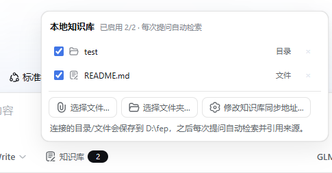

# dsh-plugin-knowledge-base

> **你的私人资料库，只存在你自己的电脑上。**
>
> 选中本地文件或文件夹，DSH 会复制一份妥善保管；之后每次提问，它只在这份副本里搜答案，并告诉你答案出自哪个文件第几行。全程不上传、不联网，数据始终在你手里。



## 它是怎么工作的

1. **连接**——在输入框左侧点「知识库」面板，选择文件或文件夹。插件会把内容**复制**到本机的同步目录(默认 `~/dsh-kb-data`,Windows 为 `C:\Users\<你>\dsh-kb-data`),原件后续移动、改名、删除都不影响检索。
2. **检索**——只要面板里有启用中的连接,每次提问模型都会自动调用 `knowledge_base` 工具,在副本里做带中文分词的全文检索。
3. **引用**——回答中来自知识库的内容会标注「副本路径 + 行号」,可自行打开文件核对。

🔒 **隐私边界**:拷贝、索引、检索全部发生在本机 DSH 进程内,没有任何网络上传行为;断开连接即删除副本。

## 安装

```powershell
# 从本地 tarball 安装到指定 profile
dsh plugin --profile <profile名> add dsh-plugin-knowledge-base-0.1.0.tgz

# 或发布到 npm 后按包名安装
dsh plugin --profile <profile名> add dsh-plugin-knowledge-base
```

安装后 `cordis.patch.yml` 会自动把插件挂载进 profile,无需改任何配置。

## 打包

```powershell
npm pack    # 产出 dsh-plugin-knowledge-base-0.1.0.tgz
```
